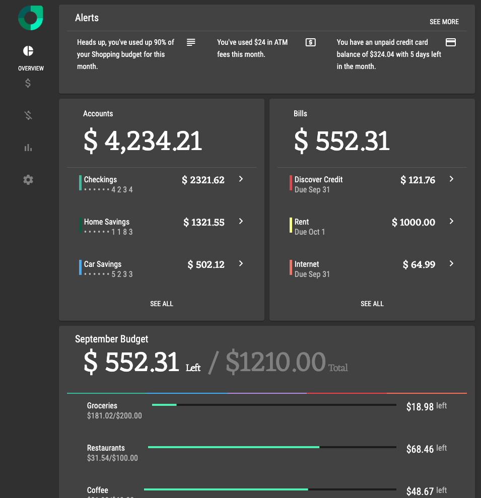

# RallyAngular

RallyAngular is a interpretation of the Material Design Case Study - [Rally](https://material.io/design/material-studies/rally.html#).

## Tools

1. [Angular](https://angular.io/)
2. [Angular Material](https://material.angular.io)

This project was generated with [Angular CLI](https://github.com/angular/angular-cli) version 8.3.2.

## Preview

